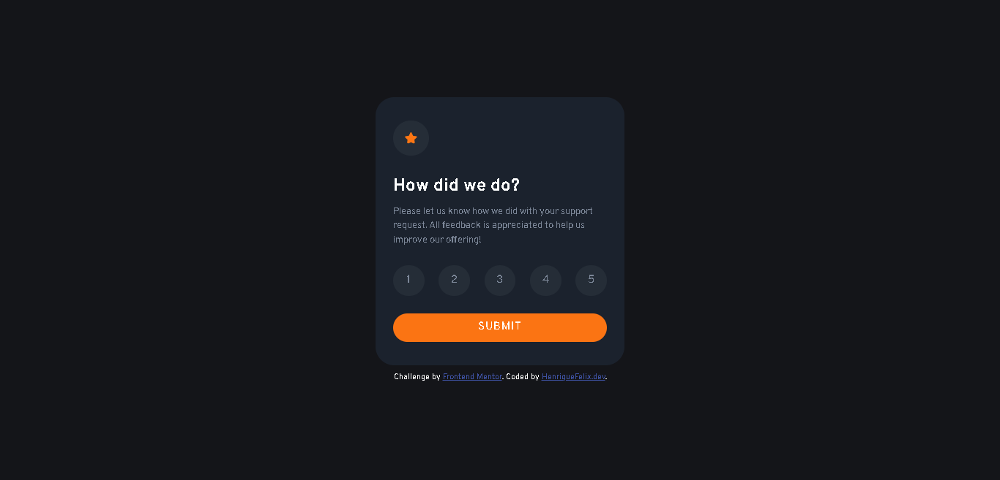

# Frontend Mentor - Interactive rating component solution

Essa é a solução para o desafio [Interactive rating component do Frontend Mentor](https://www.frontendmentor.io/challenges/interactive-rating-component-koxpeBUmI). Os desafios do Frontend Mentor ajudam a melhorar as habilidades de codificação construindo projetos reais. 

## Tabela de conteúdos

- [Overview](#overview)
  - [O desafio](#o-desafio)
  - [Links](#links)
- [Construído com](#construído-com)
- [Recursos Úteis](#recursos-úteis)
- [Autor](#autor)

## Overview

### O desafio

Os usuários podem:

- Visualizar a aplicação em diferentes tipos e tamanhos de tela (smartphones, tables, computadores, TVs etc.)
- Ver a mudança de aparência de todos os itens interativos ao passar o mouse sobre
- Selecionar e enviar uma avaliação de 1 a 5
- Ver a tela de agradecimentos(Thank You) após enviar uma avaliação

### Links

Para visualizar o projeto funcionado, [acesse o link](https://henriquefelixdev.github.io/interactive-rating-frontend-mentor/)

## Construído com

- HTML5 Semântico
- CSS customizado
- Flexbox
- Mobile-first workflow
- BEM CSS
- Animações em CSS
- Vanilla JS

## Recursos Úteis

- [Meyer CSS Reset](https://meyerweb.com/eric/tools/css/reset/reset.css) - O CSS Reset permite que os elementos fiquem com a mesma aparência em diferentes navegadores.

## Autor

- Website - [HenriqueFelix.dev](https://henriquefelix.dev.br/)
- Frontend Mentor - [@HenriqueFelixDev](https://www.frontendmentor.io/profile/HenriqueFelixDev)
- Linkedin - [@HenriqueFelixDev](https://www.linkedin.com/in/henrique-felix-dev/)